# Intro

Vision Transformer models in Rust, built with [`tch`], the Rust bindings for LibTorch.

This project is a small Rust deep learning crate for ViT-style models. It gives you typed configs, model structs, examples, and shape tests. The main model is `ViT`, and the crate also includes models for images, video, 1D signals, masked training, distillation, compact models, and mobile models.

## Visual References

### Vision Transformer Overview


The image is split into fixed-size patches, projected into tokens, processed through transformer layers, and pooled into a final prediction.

### Model Architectures

#### CaiT

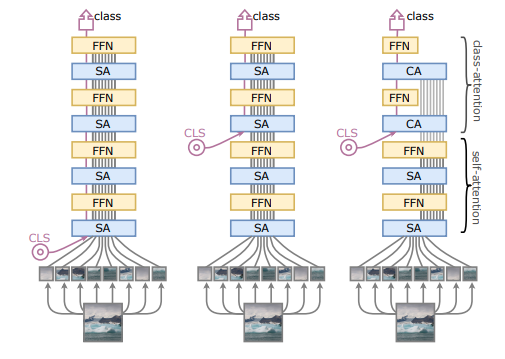

#### CvT

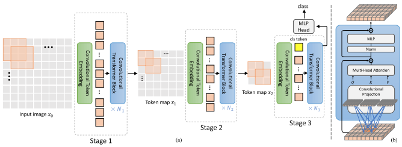

#### PiT

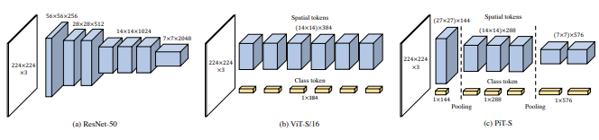

#### LeViT

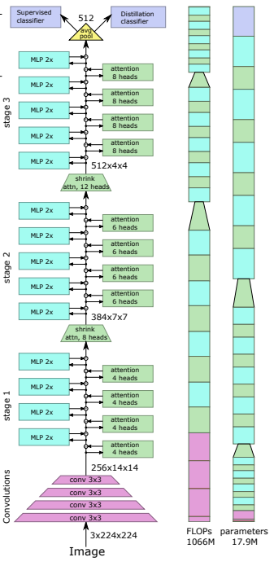

#### MaxViT

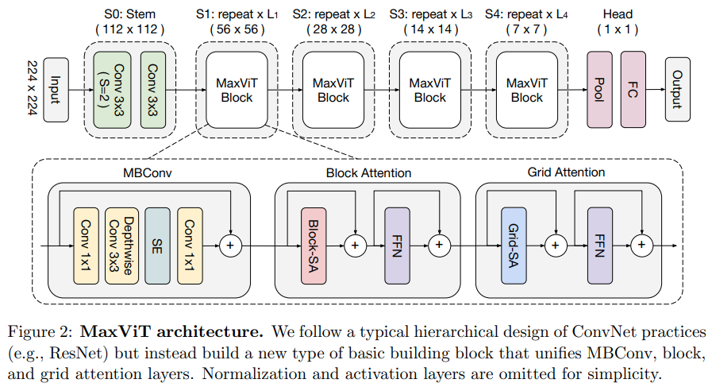

#### MAE

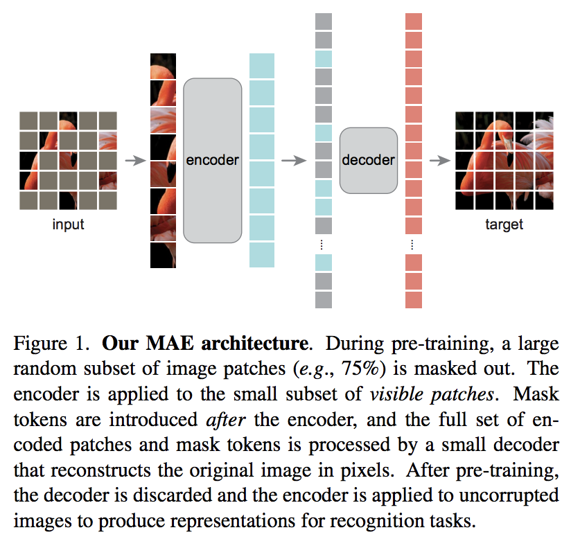

#### SimMIM

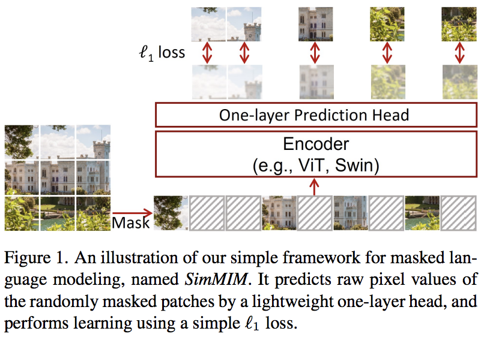

#### DINO

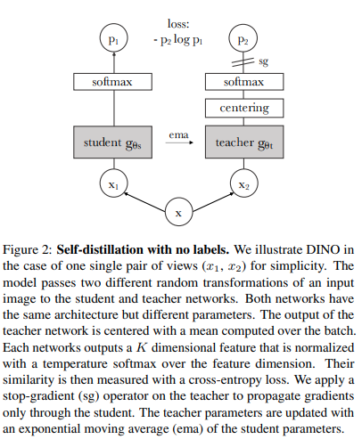

#### ViViT

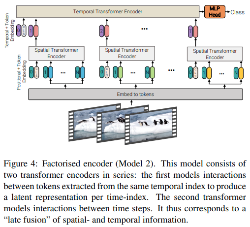

#### MobileViT

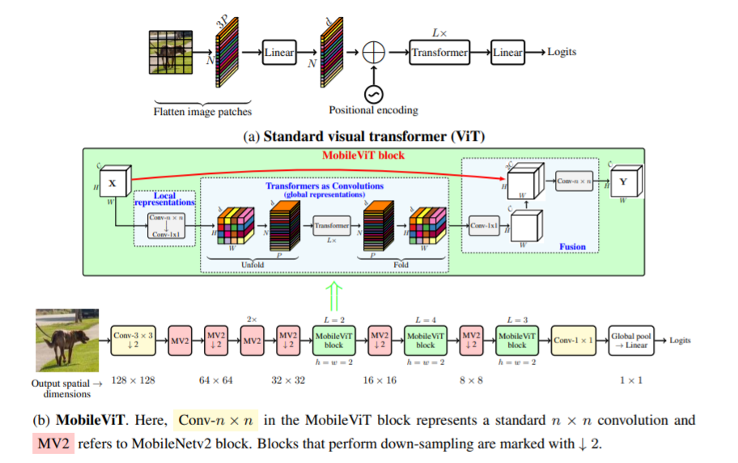

#### Distillation


#### T2T ViT

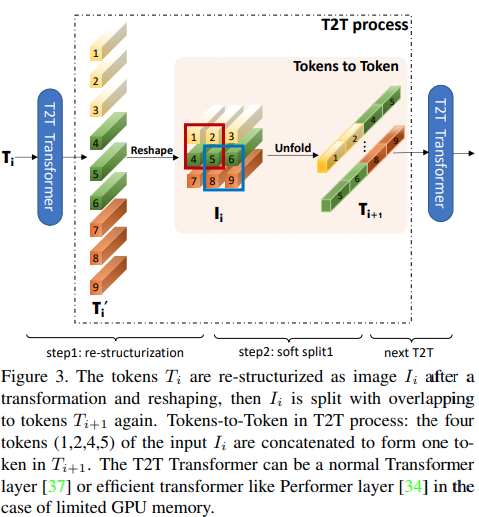

#### CrossViT

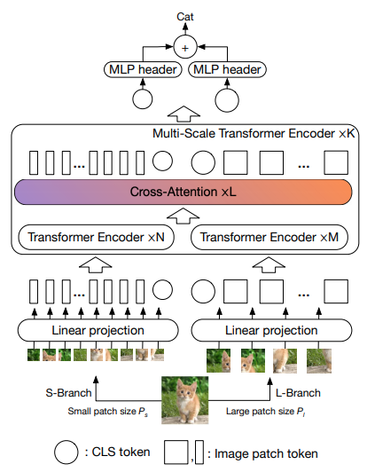

#### CrossFormer

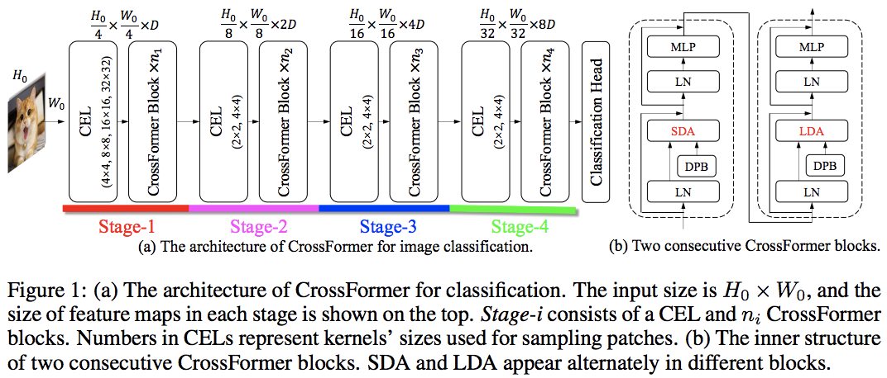

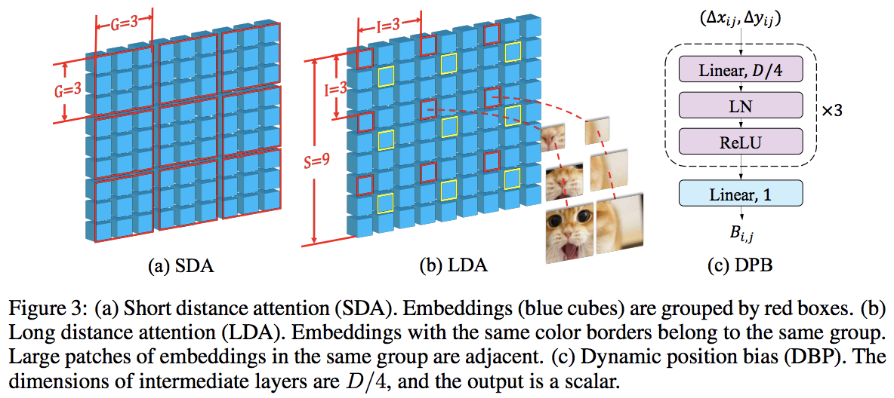

#### ViT for Small Datasets

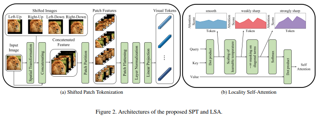

#### ATS

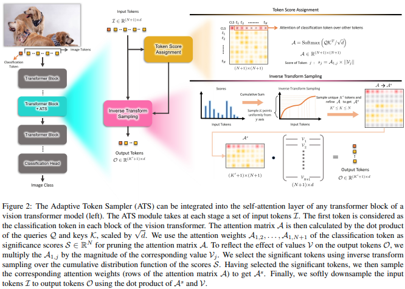

#### PatchMerger

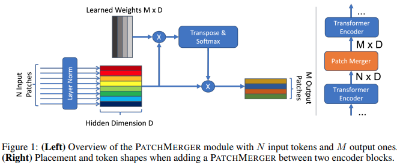

#### NesT

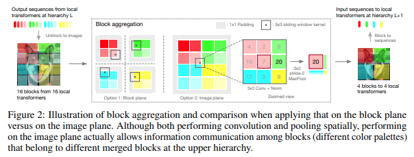

#### RegionViT

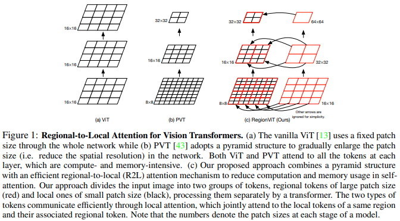

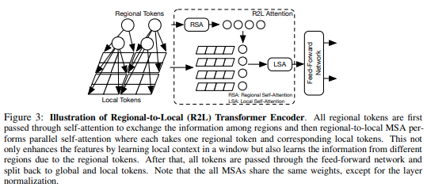

#### Scalable ViT

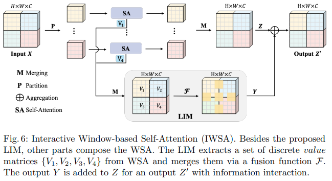

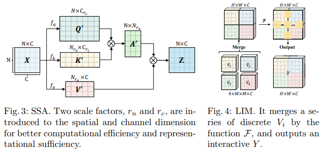

#### SepViT

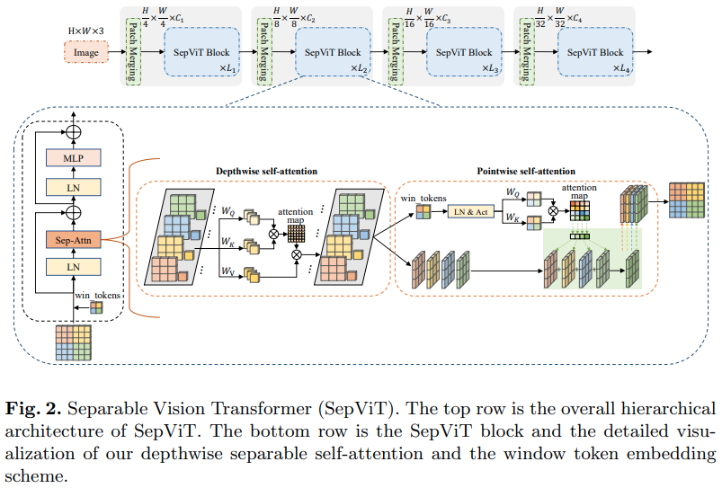

#### EsViT

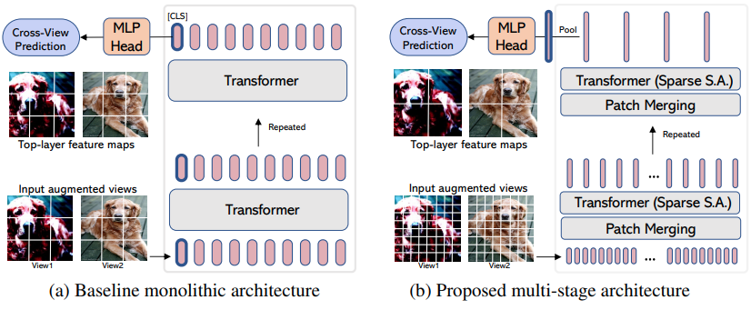

#### Parallel ViT

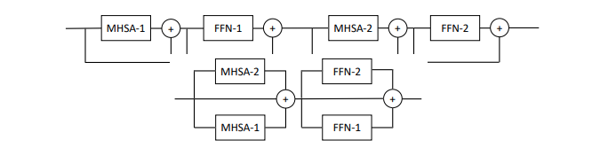

#### NaViT


#### MP3

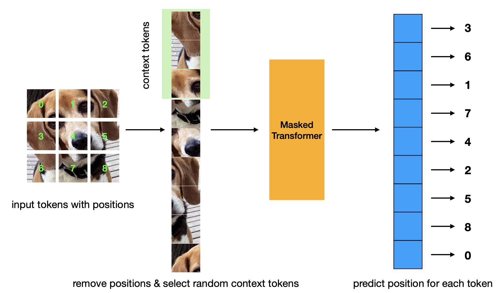

#### Learnable Memory ViT

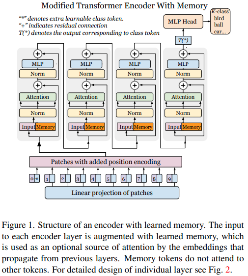

#### Twins SVT

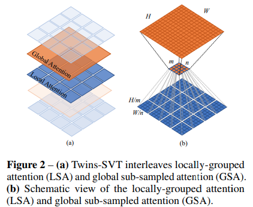

#### XCiT

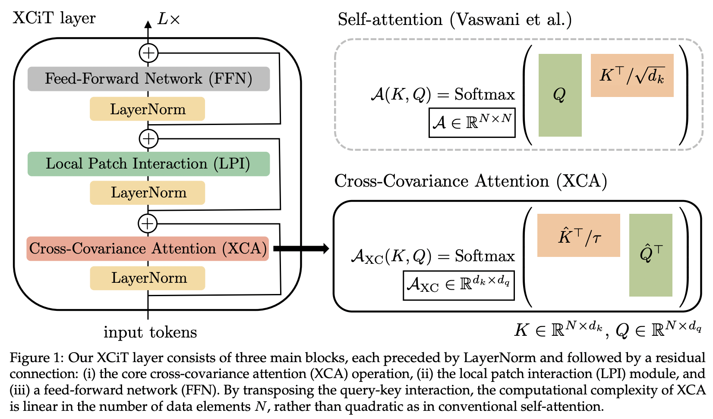

## What This Project Implements

This crate implements Vision Transformer building blocks in Rust:

- patch embedding
- position embedding
- class token and mean pooling
- multi-head self-attention
- feed-forward layers
- transformer blocks
- image, video, and sequence variants
- runtime examples and shape tests

The public API is exported from the crate root:

```rust
use vit_tch::{ImageSize, ViT, ViTConfig};
```

## How A Vision Transformer Works

A Vision Transformer treats an image like a sequence.

Normal images have this shape:

```text
[batch, channels, height, width]
```

The model changes the image into this shape:

```text
[batch, tokens, dim]
```

The flow is:

1. Split the image into patches.
2. Flatten each patch into one long vector.
3. Project each patch vector into `dim`.
4. Add position embeddings.
5. Run transformer layers.
6. Pool the tokens.
7. Predict class logits.

## Patch Math

For an image with shape `C x H x W` and patch size `P x P`:

```text
number_of_patches = (H / P) * (W / P)
patch_dim = C * P * P
```

Example:

```text
image = 3 x 256 x 256
patch = 32 x 32
number_of_patches = (256 / 32) * (256 / 32) = 64
patch_dim = 3 * 32 * 32 = 3072
```

So one image becomes 64 patch tokens. Each token starts with 3072 values, then the model maps it into the hidden size `dim`.

## Position Embeddings

After patching, the model has a list of tokens. A list alone does not tell the model where each patch came from.

Position embeddings fix that.

```text
token = patch_embedding + position_embedding
```

This lets the model know that one patch came from the top-left, another from the center, and another from the bottom-right.

## Class Token And Pooling

The model can summarize the image in two ways.

`Pool::Cls` adds a learned class token. This token gathers information from all patch tokens. The final class token is used for prediction.

`Pool::Mean` does not add a class token. It averages all final patch tokens and uses that average for prediction.

Both methods produce one vector for the whole image.

## Self-Attention Math

Self-attention is the main science behind ViT.

Each token becomes three vectors:

```text
Q = query
K = key
V = value
```

The model compares every query with every key:

```text
scores = QK^T / sqrt(d)
weights = softmax(scores)
output = weights V
```

In simple words:

- `QK^T` measures how much each patch should care about each other patch.
- `sqrt(d)` keeps the scores from getting too large.
- `softmax` turns scores into weights that add up to 1.
- `weights V` mixes useful information from other patches.

This is why one patch can use information from the whole image.

## Multi-Head Attention

One attention head learns one kind of relation.

Many heads run at the same time. One head may focus on edges. Another may focus on shape. Another may focus on object parts.

The heads are joined together and projected back into the model dimension.

```text
heads = split(tokens)
attended = attention(heads)
tokens = merge(attended)
```

## Transformer Block

A transformer block has two main parts:

```text
tokens -> attention -> tokens -> feed_forward -> tokens
```

Attention mixes information between patches.

The feed-forward layer improves each token on its own.

Layer normalization keeps training stable. Dropout can help reduce overfitting.

## Output

The last step is the prediction head.

```text
image_vector -> linear_layer -> class_logits
```

`class_logits` are raw scores. The highest score is the predicted class.

For `num_classes = 1000`, one image gives:

```text
[1, 1000]
```

For a batch of 8 images:

```text
[8, 1000]
```

## Example

```rust
use tch::{Device, Kind, Tensor, nn, nn::ModuleT};
use vit_tch::{ImageSize, ViT, ViTConfig};

fn main() {
    let vs = nn::VarStore::new(Device::Cpu);
    let model = ViT::new(
        &vs.root(),
        ViTConfig {
            image_size: ImageSize::square(256),
            patch_size: ImageSize::square(32),
            num_classes: 1000,
            dim: 1024,
            depth: 6,
            heads: 16,
            mlp_dim: 2048,
            ..Default::default()
        },
    );

    let img = Tensor::randn([1, 3, 256, 256], (Kind::Float, Device::Cpu));
    let logits = model.forward_t(&img, false);

    println!("{:?}", logits.size());
}
```

Expected output shape:

```text
[1, 1000]
```

## Main Config Fields

`image_size` is the input image size.

`patch_size` is the size of each image patch.

`num_classes` is the number of output classes.

`dim` is the hidden token size.

`depth` is the number of transformer layers.

`heads` is the number of attention heads.

`mlp_dim` is the hidden size inside the feed-forward layer.

`dropout` and `emb_dropout` control dropout.

## Included Model Families

The crate includes the base `ViT` model and several related models:

- `SimpleViT`
- `ViT1D`
- `ViT3D`
- `ViViT`
- `MobileViT`
- `CaiT`
- `CvT`
- `PiT`
- `LeViT`
- `MaxViT`
- `MAE`
- `SimMIM`
- `DINO`

These models share the same idea: turn input into tokens, process tokens, then produce an output.

## Build

Run type checks:

```bash
cargo check --features target-checks --tests --examples
```

Run a basic example:

```bash
cargo run --no-default-features --features runtime --example vit_inference
```

Run runtime tests:

```bash
cargo test --no-default-features --features runtime
```

The default feature uses `tch/doc-only`, so type-checking does not need a local LibTorch runtime.

Running examples and runtime tests needs LibTorch through one of these:

- `LIBTORCH`
- `LIBTORCH_USE_PYTORCH=1`
- `download-libtorch`

## Why ViT Matters

A convolution model usually builds vision from nearby pixels first.

A Vision Transformer can connect any patch to any other patch in one step.

That makes it good at learning:

- local details
- object parts
- long-range shape
- whole-scene context

The main tradeoff is data and compute. ViT models often need more training data or stronger training methods than small convolution models.
